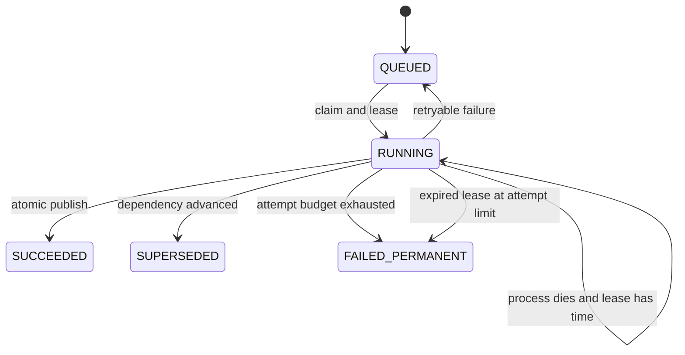

# Architecture decisions and adversarial review

This is the project's failure-mode ledger. It records each decision beside the
tempting alternative, the failure it prevents, the evidence that supports it,
and the risk that remains. The tests are the evidence for a decision, not the
prose in this file. See [DESIGN.md](DESIGN.md) for the corresponding transaction
and worker paths.

| Decision | Tempting alternative | Failure being defended against | Evidence | Remaining risk |
|---|---|---|---|---|
| Serialize mutations with a case-row lock | Rely only on the document-hash unique constraint | Two concurrent uploads both observe absence; one receives an integrity error instead of an idempotent response | PostgreSQL concurrent-ingestion test | One hot case has serialized writes |
| Append retraction tombstones | Delete or mark assertions inactive | Lost provenance and derived rows that cannot explain why they changed | Retraction and 300-mutation oracle tests | Un-retraction is not modeled |
| Use source-specific assertions | Upsert canonical claims | Independent sources are collapsed, weakening corroboration and auditability | Assertion-count and lineage tests | Entity resolution remains upstream |
| Record actual dependency reads | Infer impact from artifact type alone | A hidden read creates a false-negative invalidation | Dependency rows asserted in crash-recovery test | The application can still forget to declare a read |
| Compare key versions before publication | Trust the snapshot used during computation | A slower old worker overwrites a newer result | Deterministic compute/publish race test | Multi-key derivers need the same sorted lock discipline |
| Keep artifact publication transactional | Write the version, lineage, pointer, and job result separately | Process death leaves orphan versions or false success | Crash-after-flush-before-commit test | External side effects would need an outbox |
| Use leased, at-least-once jobs | Claim exactly-once processing | Exactly-once claims fail at process and network boundaries | Crash recovery plus job-scoped publication identity | Long computations require lease renewal |
| Fence every lease claim with a token | Treat possession of the job ID as ownership | An expired worker overwrites the successor's success or failure state | Forced claim-takeover test | Long work can still be computed twice |
| Read lease time from PostgreSQL | Trust each worker's wall clock | Clock skew steals a live lease or delays recovery | Claim code uses `CURRENT_TIMESTAMP` | Database failover clock behavior remains an operational concern |
| Retry only classified transient failures | Retry every exception | Deterministic poison input wastes the full retry budget | Poison fails once; transient fixture stops at three | The small classification list needs production telemetry |
| Bound transient retries at three attempts | Retry forever | An unavailable dependency creates unbounded work | Transient-failure and repeated-process-death tests | Retries are immediate; backoff and jitter are not built |
| Store only error classes | Persist exception messages | Parser or database errors can copy evidence into operational logs | Poison-job test checks redaction | Stack traces need the same policy outside this kernel |
| Use PostgreSQL `SKIP LOCKED` | Add Redis and Celery | More components create new delivery and recovery boundaries | Four-worker PostgreSQL CI test | SQLite cannot validate this behavior |
| Store immutable artifact versions plus a current pointer | Update one artifact row in place | Readers observe partial writes and history disappears | Transactional publication and version-count tests | Old-version retention policy is not designed |
| Key publication idempotency by job ID | Deduplicate versions by output fingerprint | A state cycle reuses dependency observations from an older revision | Equivalent-state-cycle test | Administrative job replay semantics are not designed |
| Expose dependency freshness to readers | Return the last artifact without qualification | A failed or pending recompute looks current | Pending-recompute freshness test | Callers must still enforce their own stale-data policy |
| Run schema changes with Alembic | Call `create_all` against a persistent database | Model changes drift across deployments and cannot be reviewed or rolled back | Upgrade, drift-check, downgrade, and PostgreSQL CI checks | Data backfills still need explicit migration design |
| Use an embedded worker only on the free demo | Pretend a free web process is a production worker | A sleeping instance leaves queued work pending | UI exposes freshness and the same worker has a standalone entry point | The free service processes no work while asleep |
| Require a static demo key for mutable hosted routes | Publish an anonymous write API | Public traffic creates unbounded synthetic cases and compute | API authorization test | No users, roles, rotation workflow, or per-principal audit |
| Keep payload and lineage in JSON for the kernel | Normalize every event and span now | Premature schema breadth obscures the recomputation invariant | Small synthetic workload only | Large lineage must move to normalized or object storage |
| Use change-key versions instead of the whole case revision | Invalidate on any case mutation | Unrelated evidence causes needless retries and recomputation | Three-of-one-hundred selectivity test | Incorrect key granularity can still miss an impact |

## Lock order

The implemented paths use this order:

```text
mutation: case row -> change-key rows -> artifact lookup/insert -> new jobs
worker:   job row  -> change-key rows -> artifact row -> artifact version
```

The worker does not acquire the case row. Both paths acquire change keys before
artifacts, avoiding a key/artifact lock inversion. Multi-key workers sort keys
before locking them.

## Retry state machine



`SUPERSEDED` is not a failure. The same evidence mutation that advanced the key
also enqueued the newer job in its transaction.

## Assumptions that are still intentionally unsafe

1. SQLite tests demonstrate semantics, not concurrent queue correctness. The CI
   PostgreSQL tests are the concurrency evidence.
2. Assertion immutability is enforced by the application API and permissions,
   not by database triggers. A production ledger should revoke update/delete
   privileges or add defensive triggers.
3. There is no lease heartbeat. A computation exceeding its lease could be
   claimed twice. The claim token prevents an expired owner from publishing or
   changing job state, but duplicate compute cost remains.
4. Retryable failures are retried immediately. Production needs exponential
   backoff, jitter, a next-attempt timestamp, and a dead-letter review path.
5. Cross-table case consistency is enforced by the service, not composite
   foreign keys. Direct writers could attach an assertion or job to the wrong
   case. Production should remove redundant case IDs or add composite keys.
6. Status values and state transitions have no database `CHECK` constraints.
   Worker credentials and transition guards are the current enforcement layer.
7. Model-output cache invalidation, artifact retention, role-based
   authorization, backups, and disaster recovery are deliberately not solved.
8. The hosted demo uses one static API key and has no per-user rate limit. It is
   suitable for controlled sharing, not anonymous public traffic.
9. The equivalence oracle covers deterministic structured assertions. It does
   not establish the correctness of upstream extraction or entity resolution.
